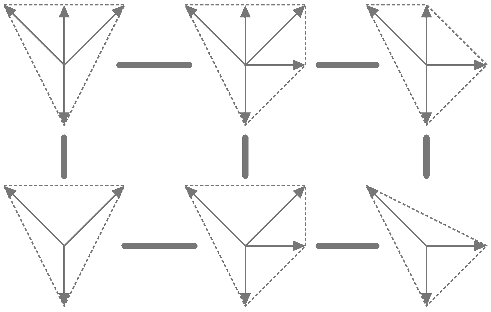

# regfans

**regfans** is a Python library for studying lattice vector configurations, developed by Nate MacFadden at the Liam McAllister Group in Cornell.

## Core Functionality

The library computes and modifies regular triangulations of vector configurations (regular polyhedral fans; "vex triangulations").

Key capabilities:
- Construct regular triangulations via lifting
- Compute all (regular) triangulations via flip graph traversal
- Verify properties of vector configurations (solid, totally-cyclic) and fans (fine, regular, point-configuration-compatible)
- Efficient linear flipping

See [Triangulations: Structures for Algorithms and Applications](https://link.springer.com/book/10.1007/978-3-642-12971-1) by De Loera, Rambau, and Santos for a definitive reference on such topics.

## Installation

Install via conda (recommended — includes pplpy):

```
conda env create -f environment.yml
conda activate regfans
```

Or via pip (see also [PyPI listing](https://pypi.org/project/regfans/)):

```
pip install regfans
```

**Note:** Most methods require dual cone computation via [pplpy](https://pypi.org/project/pplpy/), which cannot be installed automatically via pip. The conda environment handles this automatically.

## Primary Interface

The main class is `VectorConfiguration`:

```python
from regfans import VectorConfiguration

pts = [[1, -2, -1, -1], [1, 1, -1, 2], [-2, 0, 0, -1],
       [0, 0, 1, 0], [0, 1, 0, 0], [0, 0, 0, 1]]
vc = VectorConfiguration(pts)

# construct a regular triangulation via lifting
fan = vc.subdivide()
print(fan.is_fine(), fan.is_regular())

# compute all triangulations and the flip graph
all_fans = vc.all_triangulations()
G, fans, labels = vc.flip_graph(compute_node_labels=True)
```

See [documentation/api.md](documentation/api.md) for the full API reference and the [tutorials directory](tutorials/) for annotated examples.

## Citation

This package was developed for constructing toric varieties in [Calabi-Yau Threefolds from Vex Triangulations](https://arxiv.org/abs/2512.14817), supported in part by NSF grant PHY-2309456. Toric-geometric computations are provided by [CYTools](https://github.com/LiamMcAllisterGroup/cytools), which extends regfans via a `vector_config` module.
